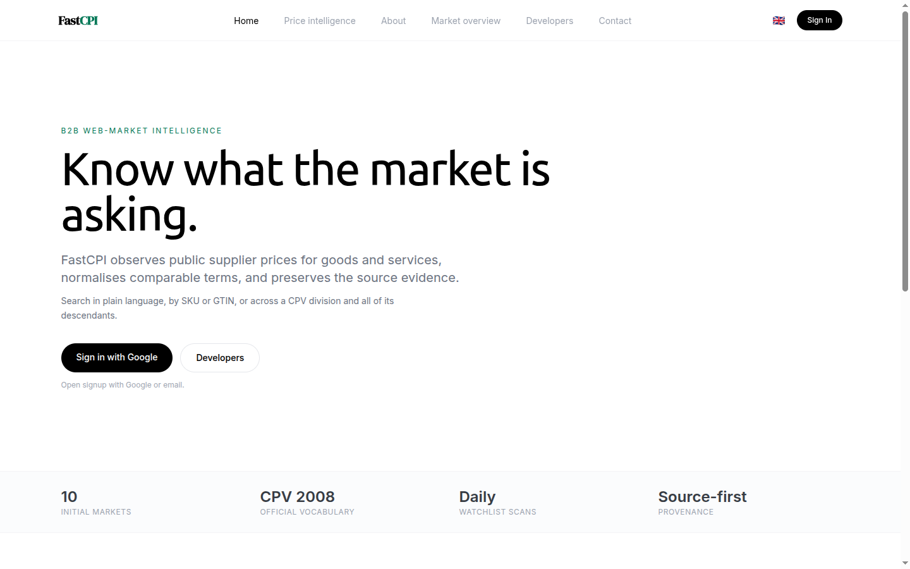
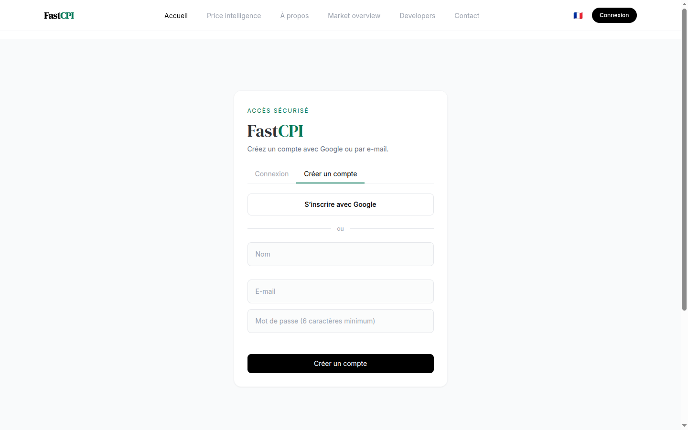
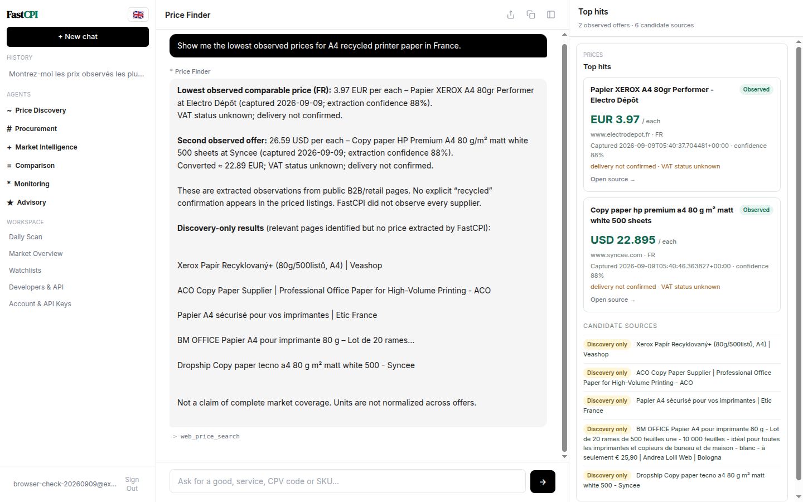
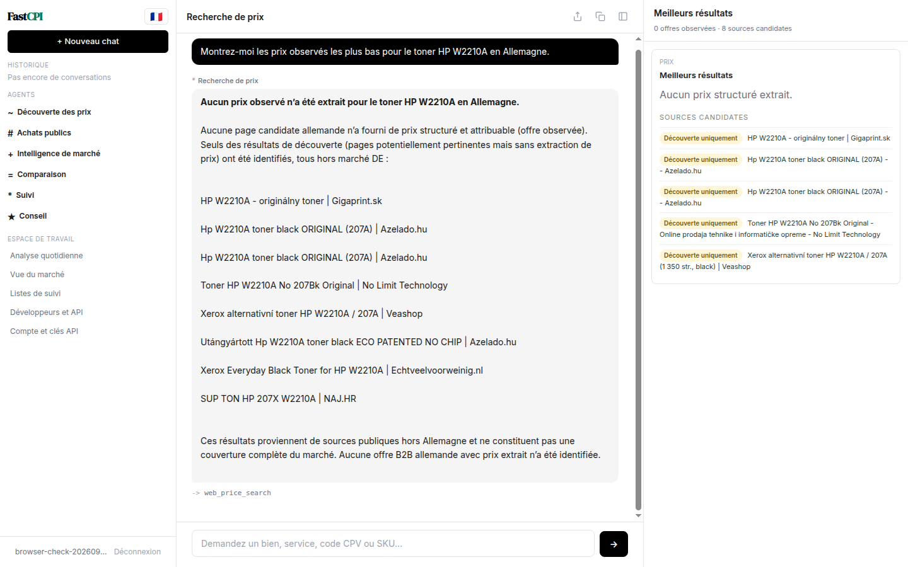
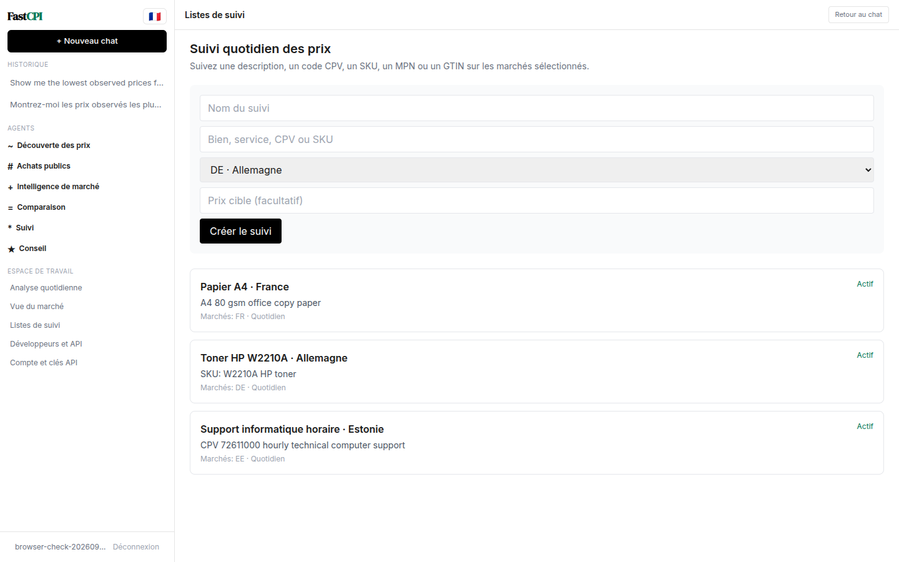
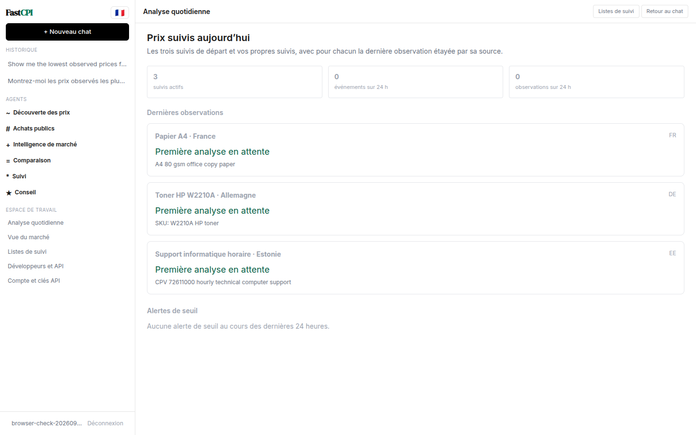
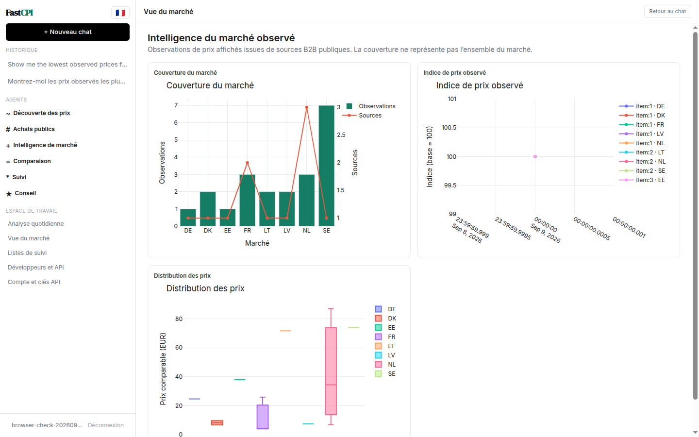
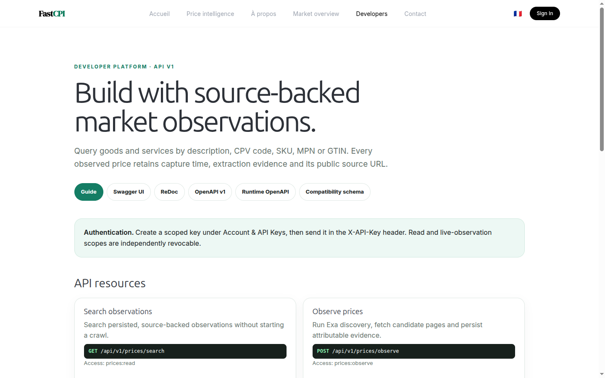
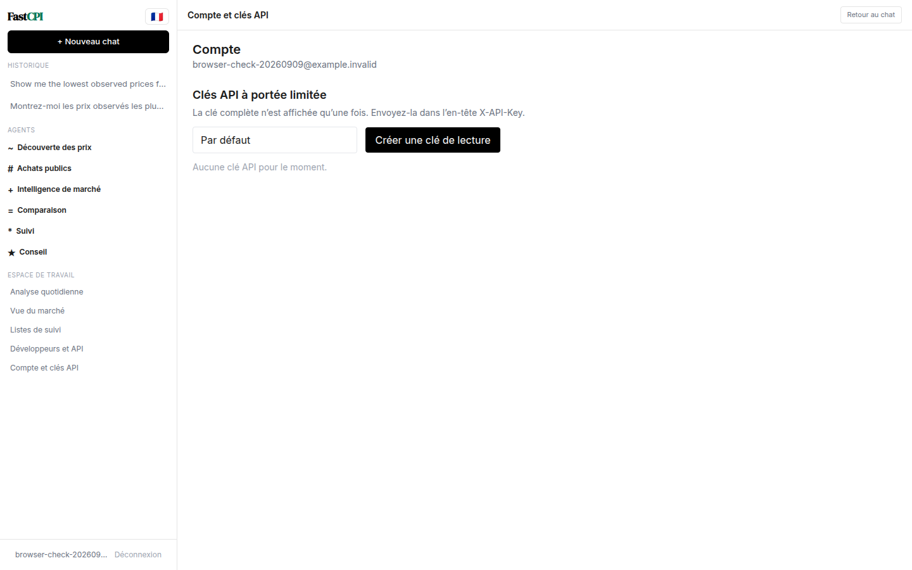

::: cover

# FastCPI

#### User Guide — Source-backed Market Price Intelligence

**Search · compare · monitor · verify**

Goods and services · CPV 2008 · SKU / MPN / GTIN · ten EU markets

Version 1.0.0 · 9 September 2026 · **cpi.fastsme.com**

:::

---

## Contents

| Section | Pages | What it covers |
|---|---:|---|
| Start | 3–5 | Product scope, account access and workspace |
| Ask & verify | 6–10 | English/French questions, source evidence and CPV |
| Monitor | 11–14 | Watchlists, daily scans and market views |
| Integrate | 15–17 | REST API, developer docs and scoped keys |
| Operate responsibly | 18 | Coverage limits and a practical workflow |

---

::: divider

## Start

Orient your team around evidence that can be opened, dated and reviewed—not an unsupported
“best price” claim.

:::

---

## FastCPI at a glance

FastCPI discovers public pages with Exa, fetches candidate pages, extracts attributable prices
and preserves the source URL, capture time, extraction method and warnings.

Use it for public B2B market observation across Germany, Denmark, Estonia, Finland, France,
Lithuania, Latvia, the Netherlands, Poland and Sweden.

- Search in plain language or with CPV, SKU, MPN and GTIN identifiers.
- Compare only offers whose units and commercial terms are compatible.
- Turn a recurring requirement into a user-specific daily watch.

---

## Sign in and choose a language

Open **https://cpi.fastsme.com** and choose **Sign In**. Google and verified email signup are
available without an invitation. Email users confirm ownership before entering the app.

The language control appears on both the landing page and inside the authenticated left pane, so
you can switch later without signing out. French covers the complete active workspace: chat,
agents, evidence, watchlists, daily scan, market overview and account/API-key controls.

The interface locale does not force the assistant’s language. Each answer follows the language
of the latest question.

---

::: divider

## Ask & verify

Ask naturally, keep identifiers exact, and open the cited page before using a price in a sourcing
decision.

:::

---

## Ask for prices in English

Describe the required good or service and name the market. Add a precise identifier, pack size,
unit, VAT basis, delivery destination or contract period when you know it.

The middle pane contains the full answer and limitations. The right pane opens to a compact set
of top hits: at most three extracted observations and five discovery-only sources. Every source
is clickable; the evidence pane does not repeat the assistant’s full narrative.

“Lowest” always means **lowest observed comparable price in the returned public-source sample**.

---

## Ask in French

Ask directly in French—for example, *« Montrez-moi les prix observés les plus bas pour le toner
HP W2210A en Allemagne. »* FastCPI sends the original question to the agent and search tools; it
does not translate or rewrite the query first.

When no attributable in-market price can be extracted, the answer says so. Candidate pages remain
visible as **Découverte uniquement** and must not be treated as observed prices.

This distinction is useful: an honest empty result is safer than turning a search snippet, an
out-of-market offer or an incompatible substitute into a benchmark.

---

## Read provenance and comparability

Each observed offer should provide:

1. Supplier/page title and clickable HTTP(S) URL.
2. Original amount, currency and advertised unit.
3. Comparable amount/unit when normalization is supportable.
4. Capture time, extraction method, confidence and warnings.
5. Market and a coverage statement.

Do not rank items when VAT, shipping, MOQ, pack quantity, product variant or service scope is
unresolved. Open the source and verify that it is current and deliverable to the intended market.

> Discovery-only means “potentially relevant page found”; it does not mean FastCPI observed a
> usable price there.

---

## Search CPV categories

Enter an eight-digit Common Procurement Vocabulary code, with or without its check digit, or ask
for a CPV label in plain language. Broad CPV divisions expand through their imported CPV Version
2008 descendants before market searching.

Useful patterns:

- `CPV 30100000-0 and descendants in France`
- `Trouver les descendants CPV des machines de bureau`
- `Compare CPV 72611000 hourly support in Estonia and Latvia`

Treat a broad-division result as category reconnaissance. Narrow the description, unit and
commercial terms before making a supplier comparison.

---

::: divider

## Monitor

Convert recurring sourcing requirements into daily checks and review both changes and evidence.

:::

---

## Create and manage a watch

Open **Listes de suivi / Watchlists**, name the requirement, enter a description or identifier,
choose a market and optionally set a target price. New accounts receive three examples:

- A4 office paper in France;
- HP W2210A toner in Germany;
- hourly technical computer support (CPV 72611000) in Estonia.

Starter watches are user-specific. Deleting one is respected; it is not recreated on every login.
The current browser UI creates and lists watches. Edit, pause, delete and run-now controls are the
next monitoring slice; those mutations already exist in the REST API where noted in OpenAPI.

---

## Review the Daily Scan

Daily Scan shows active-watch count, 24-hour observations and threshold events. Each watch shows
its latest source-backed observation or **Pending first scan / Première analyse en attente**.

Threshold events carry the source URL that caused the alert. Email alerts are sent only when the
watch enables notification. Use the page as a morning exception queue: inspect missing scans,
review price movements, open evidence, then decide whether procurement action is warranted.

The pilot scheduler currently runs inside the application process. Durable queued scan runs,
leases, retry state, domain throttling and cost quotas are the priority next slice.

---

## Use the market overview

The static Plotly dashboard summarizes observed coverage, base-100 price-index series and
comparable EUR distributions. Chat questions can also stream Plotly views into the conversation.

Read every chart with its sample size and freshness. Pilot indices are derived from observed
asking prices; they do not yet have official statistical weights, seasonal treatment, confidence
intervals or a formal revision policy.

Use these charts to find gaps, changes and outliers—not as official inflation measures.

---

::: divider

## Integrate

Use documented, scoped interfaces so external systems receive the same provenance contract as
the application.

:::

---

## Developer portal and OpenAPI

Open **https://cpi.fastsme.com/developers** for the resource guide and links to:

- Swagger UI at `/api/docs`;
- ReDoc at `/api/redoc`;
- versioned OpenAPI at `/api/openapi/v1.json`;
- runtime and compatibility schemas.

Core resources search persisted observations, run live observations, resolve CPV descendants,
read market coverage and indices, manage user watchlists and access catalog items. Live discovery
requires a stronger scope than read-only access.

---

## Scoped keys and the MCP path

Create an API key under **Account & API Keys**. The full `fcpi_…` value is shown once; store it in
a secret manager and send it in the `X-API-Key` header. Revoke and rotate keys independently of
your Google/password session.

The planned MCP alpha is read-only: observation search, CPV lookup, market overview, indices,
catalog items and methodology resources over `POST /mcp`. It will reuse FastCPI’s service layer,
tenant isolation and provenance schemas. OAuth protected-resource discovery and consent precede
any live crawl or watchlist write tool.

See `docs/ROADMAP.md` for the complete MCP surface and staged acceptance criteria.

---

## A safe weekly operating rhythm

1. **Specify:** capture exact identity, unit, quantity, VAT, delivery, MOQ and service period.
2. **Observe:** search the correct market and separate extracted evidence from discovery-only pages.
3. **Verify:** open every cited URL and exclude stale, substituted or geographically invalid offers.
4. **Compare:** rank only compatible terms; state sample count, capture time and coverage limits.
5. **Monitor:** save important requirements, review Daily Scan and investigate threshold events.
6. **Export/integrate:** use scoped keys and preserve provenance fields downstream.

Current gaps include JavaScript-only/PDF/quote-only sources, shallow supplier-specific parsers,
incomplete pack/VAT/shipping/MOQ normalization and process-local scheduling. Report questionable
evidence rather than silently treating it as comparable.

**Support:** use the Contact page. **API:** `/developers`. **Roadmap:** `docs/ROADMAP.md`.
